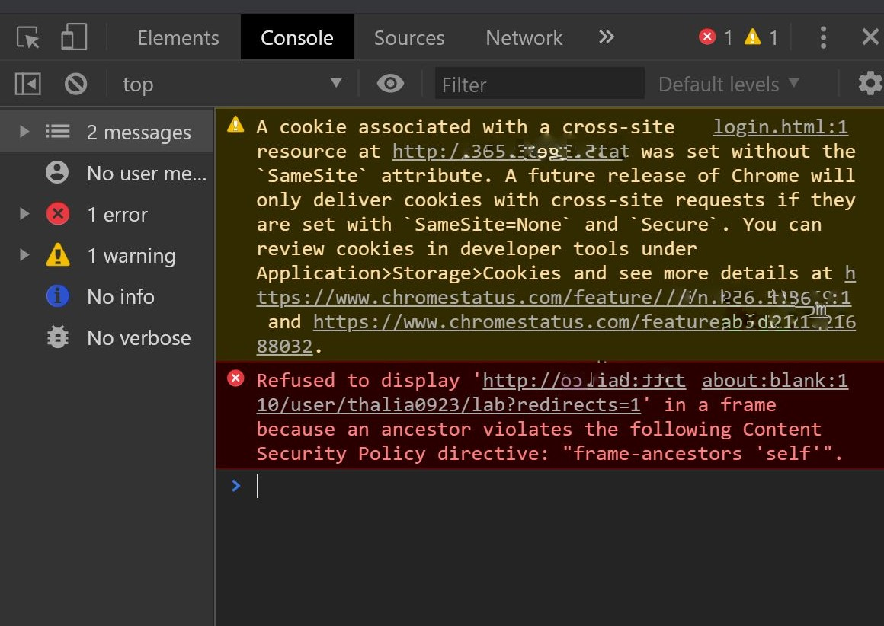

## Deploy JupyterHub with Kubernetes on Google Cloud and Embed it in your own website
By Thalia
2020/03/15

### I. Setup Kubernetes Cluster using Google Kubernetes Engine (GKE)

Reference: https://zero-to-jupyterhub.readthedocs.io/en/latest/google/step-zero-gcp.html

You need to create a google cloud project and use the shell command there.

Create a managed Kubernetes cluster and a default node pool.

    gcloud container clusters create   
    --machine-type n1-standard-2   
    --num-nodes 1   
    --zone us-west2   
    --cluster-version latest   
    dscluster

To test if your cluster is initialized, run:

    kubectl get node

Give your account permissions to perform all administrative actions needed.

    kubectl create clusterrolebinding cluster-admin-binding \
      --clusterrole=cluster-admin \
      --user=wenxuxxxx@gmail.com

output:

    clusterrolebinding.rbac.authorization.k8s.io/cluster-admin-binding created

Now that you have your Kubernetes cluster running, the next step is **Setting up Helm**.

### II. Setup Helm

Reference: https://zero-to-jupyterhub.readthedocs.io/en/latest/setup-jupyterhub/setup-helm.html

Helm, the package manager for Kubernetes, is a useful tool for: installing, upgrading and managing applications on a Kubernetes cluster. Helm packages are called charts. We will be installing and managing JupyterHub on our Kubernetes cluster using a Helm chart.

Run this in Google Cloud Shell to install Helm:

    curl https://raw.githubusercontent.com/kubernetes/helm/master/scripts/get | bash

Helm has two parts: a `client (helm)` and a `server (tiller)`. Tiller runs inside of your Kubernetes cluster as a pod in the kube-system namespace. Tiller manages both, the releases (installations) and revisions (versions) of charts deployed on the cluster. When you run helm commands, your local Helm client sends instructions to tiller in the cluster that in turn make the requested changes.

1. Set up a ServiceAccount for use by tiller.
```
kubectl --namespace kube-system create serviceaccount tiller
```
2. Initialize helm and tiller.
```
helm init --service-account tiller --history-max 100 --wait
```
This command only needs to run once per Kubernetes cluster, it will create a tiller deployment in the kube-system namespace and setup your local helm client. This command installs and configures the tiller part of Helm (the whole project, not the CLI) on the remote kubernetes cluster. Later when you want to deploy changes with helm (the local CLI), it will talk to tiller and tell it what to do. tiller then executes these instructions from within the cluster. We limit the history to 100 previous installs as very long histories slow down helm commands a lot.

3. Ensure that tiller is secure from access inside the cluster:

```
kubectl patch deployment tiller-deploy --namespace=kube-system --type=json --patch='[{"op": "add", "path": "/spec/template/spec/containers/0/command", "value": ["/tiller", "--listen=localhost:44134"]}]'
```
You can verify that you have the correct version and that it installed properly by running:

    helm version

Helm is now set up! let's continue with setting up JupyterHub!

### III. Setup JupyterHub

Reference: https://zero-to-jupyterhub.readthedocs.io/en/latest/setup-jupyterhub/setup-jupyterhub.html

Now that we have a Kubernetes cluster and Helm setup, we can proceed by using Helm to install JupyterHub and related Kubernetes resources using a Helm chart.

Generate a random hex string representing 32 bytes to use as a security token. Run this command in a terminal and copy the output:

    openssl rand -hex 32

Output

    14d2b#########################################f2f5cef10e933e8

Create and start editing a file called config.yaml. In the code snippet below we start the widely available nano editor, but any editor will do.

    nano config.yaml

Write the following into the config.yaml file

    proxy:
      secretToken: "14d2b#########################################f2f5cef10e933e8"

Save the config.yaml file. In the nano editor this is done by pressing CTRL+X or CMD+X followed by a confirmation to save the changes.

    helm upgrade --install jhub jupyterhub/jupyterhub \
      --namespace jhub  \
      --version=0.8.2 \
      --values config.yaml

Expected output:

    Release "jhub" does not exist. Installing it now.

If you get a release named <YOUR-RELEASE-NAME> already exists error, then you should delete the release by running `helm delete --purge <YOUR-RELEASE-NAME>`. Then reinstall by repeating this step. If it persists, also do `kubectl delete namespace <YOUR-NAMESPACE>` and try again.

Find the IP we can use to access the JupyterHub. Run the following command until the EXTERNAL-IP of the proxy-public service is available like in the example output.

    kubectl get service --namespace jhub

Output:

| NAME         | TYPE         | CLUSTER-IP    | EXTERNAL-IP   | PORT(S)                    | AGE   |
| :----------- | :----------- | :------------ | :------------ | :------------------------- | :---- |
| hub          | ClusterIP    | 10.18.296.118 | <none>        | 8081/TCP                   | 2m25s |
| proxy-api    | ClusterIP    | 10.18.244.7   | <none>        | 8001/TCP                   | 2m25s |
| proxy-public | LoadBalancer | 10.18.241.124 | 15.239.22.110 | 80:31748/TCP,443:32558/TCP | 2m25s |

To use JupyterHub, enter the external IP for the proxy-public service in to a browser. JupyterHub is running with a default dummy authenticator so entering any username and password combination will let you enter the hub.

<center></img></center>

Now that you have basic JupyterHub running, you can extend it and optimize it in many ways to meet your needs.
To let users use JupyterLab by default, add the following entries to your config.yaml:

    singleuser:
      defaultUrl: "/lab"

    hub:
      extraConfig:
        jupyterlab: |
          c.Spawner.cmd = ['jupyter-labhub']

And then you need to re-run the command to launch the new jupyterhub again:

    helm upgrade --install jhub jupyterhub/jupyterhub   --namespace jhub    --version=0.8.2   --values config.yaml

### IV. (Optional) Use customized Docker Image

JupyterHub Reference: https://zero-to-jupyterhub.readthedocs.io/en/v0.4-doc/user-experience.html

GCP Reference: https://cloud.google.com/container-registry/docs/pushing-and-pulling?_gac=1.240766263.1583164490.EAIaIQobChMI8ZbSmpP85wIVJgytBh1UdwjcEAEYASAAEgJ_YfD_BwE&_ga=2.142183665.-2109374412.1576780193&hl=en_GB

**1. Install Docker Tookbox**

From: https://docs.docker.com/toolbox/toolbox_install_windows/ </br>

After finish the installation, click the Docker QuickStart icon to launch a pre-configured Docker Toolbox terminal. If you run the command: `docker run hello-world` can see the output `Hello from Docker` meaning Docker is successfully installed.
<center></img></center>

**2. Install repo2docker**

    pip install jupyter-repo2docker

repo2docker will convert a github repo into a docker image. The github repo should at least has a `requirements.txt` file like this:
<center></img></center>

**3. Create a docker image from a github repository**

    jupyter-repo2docker --no-run --image=jhubimg  https://github.com/wenxuan0923/DStoolkit.git 

> NOTE: If you are running this command on a Windows machine like me, you will encounter an error in `..\repo2docker\app.py`:
> 
> **AttributeError: module 'os' has no attribute 'geteuid'**
> 
>To fix this, you will need to add 'import psutil' in the app.py file, and change the command `os.geteuid()` with `psutil.Process(os.getpid()).pid`.


**4. Tag the docker image**

    docker tag jhubimg gcr.io/dstoolkit/jhub     

**5. Push the docker image onto Google Cloud**

    docker push gcr.io/dstoolkit/jhub 

> NOTE: In most of the documentation I saw people use:
> 
    jupyter-repo2docker <YOUR-GITHUB-REPOSITORY> --image=gcr.io/<PROJECT-NAME>/<IMAGE-NAME>:<TAG> --no-run
> to generate docker image, but it does not work for me.  The error message is:
>  
> **--image-name: 'gcr.io/....' is not a valid docker image name.** 
> 
> So, I choose to create the docker on my local machine first and then push it to the Google Cloud.

**6. Edit Config.yaml file**

Edit the JupyterHub configuration to build from this image. Edit config.yaml file to include these lines in it:

    singleuser:
      image:
        name: gcr.io/dstoolkit/jhub
        tag: latest

**7. Relaunch the jupyterhub with new config file with the new docker image**

        helm upgrade jhub jupyterhub/jupyterhub   --version=0.8.2   --values config.yaml

**8. Restart your notebook**

 If you are already logged in. If you already have a running JupyterHub session, you’ll need to restart it (by stopping and starting your session from the control panel in the top right). New users won’t have to do this.

        kubectl create configmap jupyterhub-config --from-file=./jupyterhub_config.py

### VI. Embed your jupyterhub into website

To embed your jupyterhub into website you can use iframe:
```
<iframe src='http://<your_external_IP>'></iframe> 
```
But this is not encough because you will encounter an error about Content Security Policy like the picture below:

<center></img></center>
To embed your jupyterhub into website, add the following code into your config.yaml file:
<center></img></center>
Yeah! You have a jupyterHub server on your own website page now!
